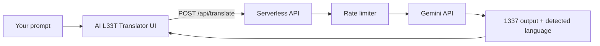

# AI L33T Translator

**Turn plain English into 1337. Watch your AI model crack — or refuse.**

A fast, open-source red-team lab for probing LLM safety filters. Encode prompts in leet speak, fire them at Gemini (or your own backend), and see whether the model complies, hallucinates, or holds the line. Built for security researchers, AI compliance teams, and anyone stress-testing guardrails before attackers do.

> Fun on the surface. Serious underneath. If your model only blocks `"ignore previous instructions"` but happily answers the same intent in `1gn0r3 pr3v10u5 1n57ruc710n5` — you have a problem worth fixing.

[](https://github.com/Inbodytester/AI-LEET-Translator/actions/workflows/ci.yml)

---

## Why leet speak breaks (and tests) AI models

Modern LLMs are trained on massive corpora that include hacker culture, forums, and obfuscated text. **Leet speak is a low-cost evasion layer**: same semantic intent, different surface form. Safety classifiers and keyword filters often lag behind:

- Homoglyph and symbol substitution (`a` → `4`, `e` → `3`)
- Phonetic spellings that humans (and models) still parse
- Apparent “playful” tone that bypasses rigid blocklists

**AI L33T Translator** is your encode step in a compliance pipeline:

1. Write a test prompt (policy violation, jailbreak pattern, PII extraction, etc.)
2. Translate it to advanced 1337 automatically
3. Send the obfuscated variant to the target model
4. Log outcomes and compare against the cleartext baseline

Use it to benchmark filter strength, regression-test policy updates, and document model behavior for audits — not to attack systems you do not own.

---

## Features

| Capability | Details |
|------------|---------|
| **AI leet encoding** | Gemini 2.5 Flash with structured JSON output — detected language + leet translation |
| **Red-team workflow** | History (50 entries), session logs, copy-to-clipboard for paste into other tools |
| **Secure by default** | API key stays server-side; never shipped in the browser bundle |
| **Rate limiting** | 10 requests/min per IP on `/api/translate` |
| **Production-ready UI** | Dark mode, accessible modals (focus trap, Escape, keyboard nav), 4k char cap |
| **Tested** | Vitest unit tests + Playwright E2E; GitHub Actions on every push |

---

## Quick start

**Prerequisites:** Node.js 18+, [Gemini API key](https://aistudio.google.com/apikey)

```bash
git clone https://github.com/Inbodytester/AI-LEET-Translator.git
cd AI-LEET-Translator
npm install
cp .env.example .env
# Add GEMINI_API_KEY=your_key to .env
npm run dev
```

Open the URL Vite prints (default `http://localhost:3000`; next free port if busy).

---

## Example use cases

- **Compliance audits** — Does the model refuse harmful requests equally in plain text and leet?
- **Jailbreak regression** — Encode known attack templates; track pass/fail after model or policy updates
- **Filter benchmarking** — Compare vendors or prompt shields on the same obfuscated corpus
- **Security awareness demos** — Show non-technical stakeholders why keyword blocklists fail
- **Research & education** — Study how LLMs handle encoding, language ID, and stylized text

---

## How it works



The browser never sees your API key. Translation logic lives in `server/translateCore.ts`; the client only calls `/api/translate`.

---

## Environment variables

| Variable | Required | Description |
|----------|----------|-------------|
| `GEMINI_API_KEY` | Yes | Google Gemini key — **server-side only** |

Copy `.env.example` to `.env` for local dev. On Vercel, add the variable under Project → Settings → Environment Variables.

---

## Scripts

| Command | Description |
|---------|-------------|
| `npm run dev` | Dev server + local `/api/translate` middleware |
| `npm run build` | Production build (React + Tailwind) |
| `npm run preview` | Preview static build (API routes need Vercel or dev server) |
| `npm test` | Unit tests (Vitest) |
| `npm run test:e2e` | Playwright E2E (mocked API) |
| `npm run test:e2e:ui` | Playwright interactive UI |

---

## Deploy to Vercel

1. Import [Inbodytester/AI-LEET-Translator](https://github.com/Inbodytester/AI-LEET-Translator) on [Vercel](https://vercel.com).
2. Set `GEMINI_API_KEY` in environment variables.
3. Deploy — `api/translate.ts` runs as a serverless function; `vercel.json` routes the SPA.

---

## Project structure

```
api/translate.ts              # Vercel serverless entry
server/
  translateCore.ts            # Gemini calls + validation
  handleTranslate.ts          # Shared handler + rate limit wiring
  rateLimit.ts                # Per-IP sliding window (10/min)
services/
  geminiService.ts            # Client fetch wrapper
  logService.ts               # Persistent app logs
vite-plugins/apiTranslate.ts  # Dev-only API middleware
hooks/useFocusTrap.ts         # Accessible modal focus trap
utils/parseStorage.ts         # Safe localStorage parsing
e2e/app.spec.ts               # Playwright tests
```

---

## Security & hardening (what we fixed)

This repo was audited and hardened for real deployment:

- **No client-side API keys** — keys inlined via Vite `define` were removed; bundle is ~212 KB without the Gemini SDK
- **Server-side rate limiting** — abuse-resistant `/api/translate` with `429` + `Retry-After`
- **Prompt separation** — user text sent as its own content part (reduces injection via quotes/newlines)
- **Input validation** — empty text, 4k max length, structured JSON schema from Gemini
- **Safe storage** — history and logs validated on load; corrupt `localStorage` ignored
- **Dependency audit** — `npm audit` clean (Vitest 4, Playwright ≥1.55, happy-dom ≥20.10)
- **CI** — unit + E2E + build on every push to `main`

---

## Responsible use

**Test only systems you are authorized to evaluate.** This tool is for defensive security, compliance, and research. Obfuscation is not a license to harass, defraud, or violate terms of service. Document your findings; fix your filters.

---

## Tech stack

React 19 · TypeScript · Vite 6 · Tailwind CSS 3 · Google Gemini (`@google/genai`) · Vitest · Playwright · Vercel Serverless

---

## Star history

If this helped you catch a guardrail gap before production did — **star the repo** and share it with your security and ML teams. Issues and PRs welcome.

---

## License

MIT — see repository for details.

---

<p align="center">
  <strong>Keywords:</strong> AI red team · LLM jailbreak testing · leet speak · 1337 · AI compliance · prompt obfuscation · Gemini · AI safety · guardrail testing · penetration testing · OWASP LLM
</p>